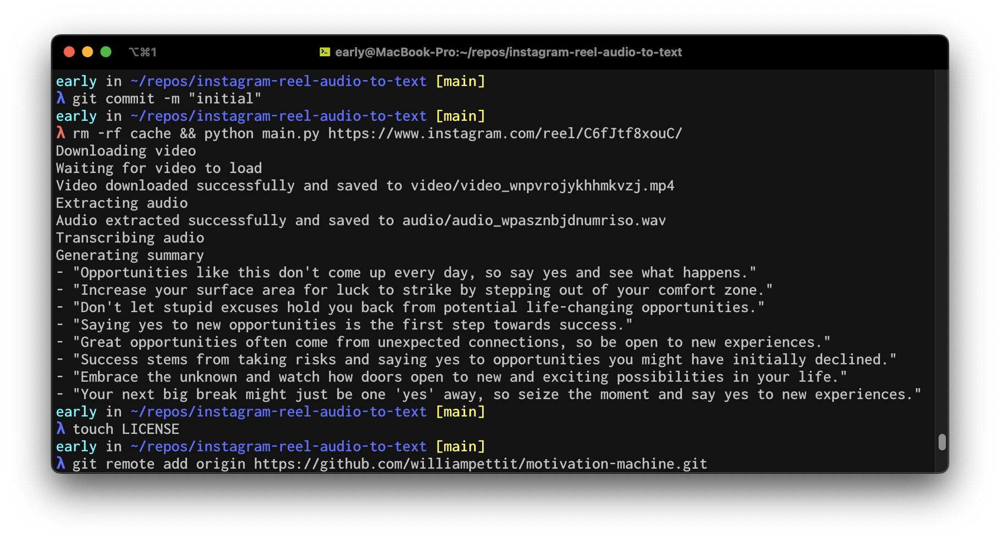

# motivation-machine
This script uses speech-to-text and language models to convert "motivational videos" into simple, easy to digest quotes.

Essentially, my script scrapes the video, extracts the audio, transcribes it, then generates quotes by utilizing the ideas discussed, thereby extracting the most valuable moments into text form. 

I created this because I enjoy listening to these videos, but often run into various problems, such as the speaker talking too fast, and I started to feel like I absorbing and digesting all that there was to be gained from the video or speaker. 

## Installation
- `pip install -r requirements` (virtual environment recommended)
- You'll also need to set up a `.env` file with an OpenAI key, with access to "whisper-1" and "gpt-3.5-turbo" enabled. See `.env.example` for more info

## Usage
- `python main.py <url>`
- For now, YouTube and Instagram are the only supported video platforms. 

## License
MIT
